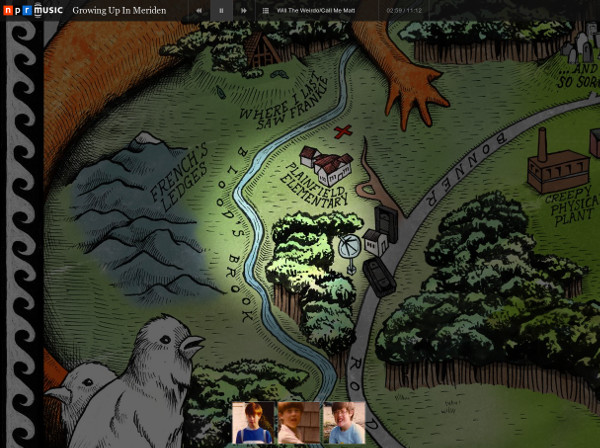
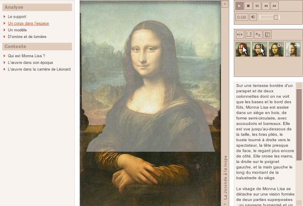

The halo effect is typically used for highlighting a specific area on a map.

##Examples

Growing up in Meriden
http://apps.npr.org/okkervil-river/

Le Louvre – Œuvres à la loupe – La Joconde 
Mise en évidence des balustrades http://musee.louvre.fr/oal/joconde/indexFR.html

